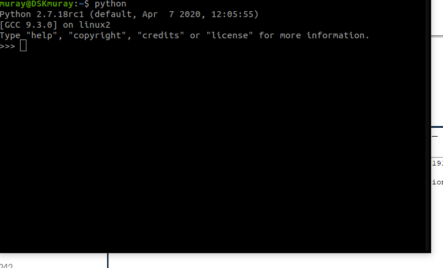
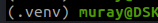
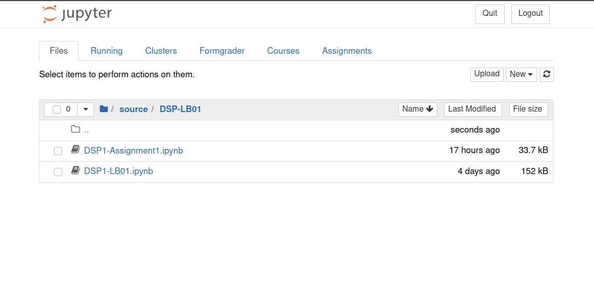

For most of my courses at SUAS, Python is the main programming/scripting language to use. This blog post is intended to serve as a tutorial for my students and all other interested. This tutorial does not provide a lot of insights on "why?", it should one only guide through the installation process to a working environment with a Jupyter notebook.

Feedback is very welcome and appreciated. Just send me a mail on the mail address shown in the footer.


## Installation of the Python Interpreter

### Under Windows
The first thing you need is the python interpreter itself. Go to the download page of [python.org](https://www.python.org/downloads/) and download an appropriate version. At the time of writing this post, I prefer using python 3.8.

__Attention:__ do not download and install Python 2.X! Python2 is _end-of-life_ and differs significantly, also in syntax and functionality, from the state-of-the-art Python3.X.

When starting the installer, you are asked how to install the interpreter. Before choosing the installation mode, check the _Add Python 3.X to PATH_.

Next, you are asked what optional features to install. Here check at least _pip_ and _td/tk and IDLE_. The rest is up to you.

The advanced options offer additional options. Here, check the checkbox _Add Python to environment variables_. Then you can proceed to the installation.

### Under Linux
This is highly dependent on the Linux distribution and the version. If you are a *NIX user, you know to install stuff anyway. 🙂

### OSX
Sorry, I am not a Mac user and therefore I have no experience or idea on how to install anything... 🙈

## Verify installation
To verify, if you installed python correctly, open a terminal. Under windows enter press the windows key and enter `cmd`+enter.
When the command line is open, enter `python`. You should see something like:



In this window, you can see the version of the python interpreter.
If the command line prompts an error, where it is said, that the program or executable _python_ could not be found, make sure that the path to the python interpreter was put to the environment variables and/or to the PATH. (you can close the Python interpreter using either CTRL+D or by typing in `exit()`)

## Setup of a Python Environment
A Python Environment can be considered as a virtual container, in which all packages are installed, that are installed when the environment is activated. The environment is just a folder with the installed components and a dedicated interpreter in there. You will see how this is structured at the end of this section.

To install `virtualenv`, the application managing the environment for us, we also use the command line. For installation, simply call

```
pip install virtualenv
```

`pip` is our python package manager. With this application nearly every library or package can be downloaded.

Then, using `cd`, navigate with the command line to the directory, where you want your project files to be in. E.g. `cd C:/Users/Martin/FH/DSP/Lab`. In that directory, create a virtual environment, calling

```
virtualenv .venv
```
where `.venv` is the name of the virtual environment. The leading `.` indicates a hidden directory, so we are not visually distracted when browsing through the folder (just a convenience thing). The folder structure of a virtual environment in windows looks like the following:

```
.venv
+-- etc/
+-- Lib/
|   +-- ...
+-- Scripts/
|   +-- activate
|   +-- activate.bat
+-- share/
|   +-- ...
+-- pyvenv.cfg
```

For the moment, only the `Scripts/` folder is necessary for us. To start the virtual environment, browse to this folder (e.g. by `cd .venv` and `cd Scripts`) and activate the environment by calling the `activate.bat` (simply type the name in the command line and execute).

Under Linux, the structure looks a bit different. There the activation script is stored in `.venv/bin` and is called using `./activate`.
Hint for Linux users: create an aliased, that automatically create and activate your environment, something like the following (put those lines into your `.bashrc` or a config file that is called by that);
```
alias mkvenv='virtualenv .venv'
alias venv='source .venv/bin/activate'
```

In both cases (Windows and Linux), you must have noticed a change in the prompt. Leading, the name of the environment in brackets should be displayed:




## Installation of additional packages
As already mentioned in the section above, we are using `pip` as our package manager. To install packages, simply call `pip install <package>`.

To install the initially necessary packages for our courses, simply call the following:

```
pip install jupyter
```

If this is not working, pip needs to be called as a module from python:

```
python -m pip install jupyter
```

Other dependencies that are needed throughout my courses are then installed using the provided notebooks.

## Jupyter Notebooks

Jupyter notebooks can be compared and are similar to Matlab's live scripts. They contain live code, equations, visualizations, and narrative text.

With the already installed packages, you have two ways of using notebooks: either with _Jupyter Lab_ or as a single notebook. _Jupyter Lab_ offers more features like an IDE and is (to the most extend) compatible with the single notebook. To start _Jupyter Lab_, simply start

```
jupyter lab
```

For the notebook only version, use

```
jupyter notebook
```

For both cases, a web server will be started. Normally a browser should pop up. If not, you will see an URL displayed. Copy and paste that URL into your browser.
The started notebook webserver should then look similar to the following




## PyCharm IDE
If you don't really like working in a browser and you like the convenience of a well optimized IDE, I recommend you install _PyCharm_. For working notebooks, the community edition (the free version) is not sufficient anymore. For this, the commercial Pro version needs to be downloaded.
Lucky you (at least if you are a student), _PyCharm_ offers free Edu-licences. Simply go to the [_PyCharm_](https://www.jetbrains.com/de-de/pycharm/download/) website and create an account. There you can request the Edu-licence. When installing the Professional version you need to enter your credentials to be able to use those features.

In _PyCharm_ you then have a side-by-side view with code (looks like a section python script) and the live converter and rendered notebook. For more information on notebooks in _PyCharm_ please visit [this link](https://www.jetbrains.com/help/pycharm/jupyter-notebook-support.html#get-started).
